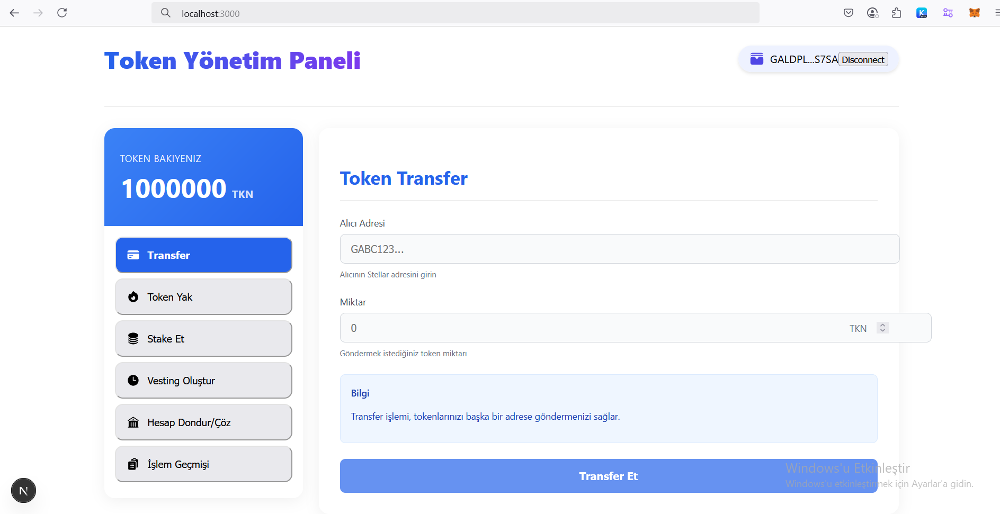
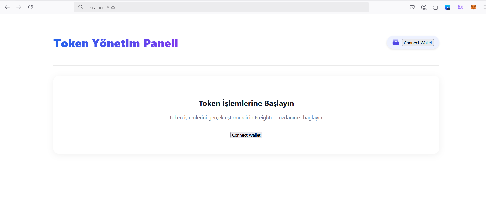
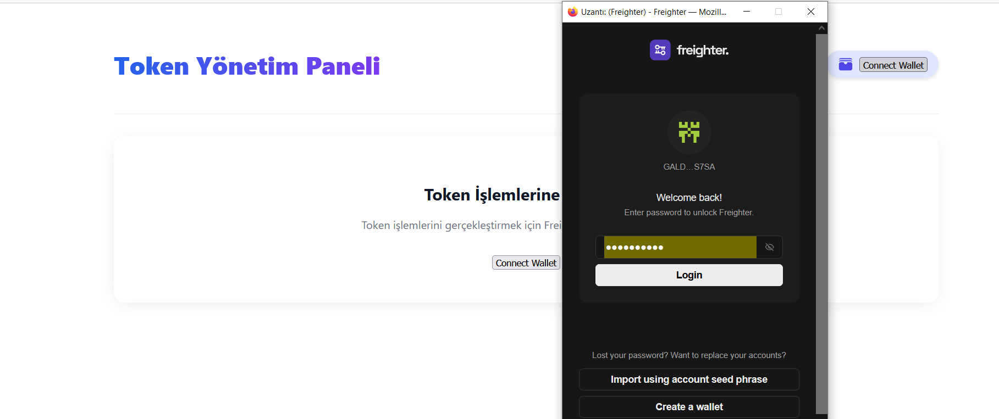
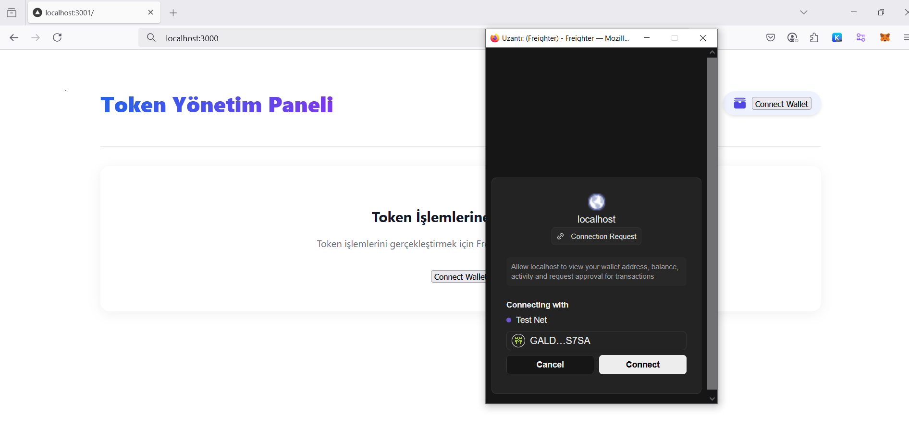

## Stellar Token Management Panel
A user-friendly, modern dashboard interface for token management on the Stellar network. This panel allows you to easily perform token transfer, burning, staking and vesting operations by interacting with Soroban smart contracts.

## 

## 🌟 Features

Token Transfer: Send your tokens to other addresses
Token Burn: Reduce the amount of tokens in circulation
Staking: Earn rewards by locking tokens for a certain period of time
Vesting Plans: Create gradual token release plans
Account Freeze/Unfreeze: Restrict or reopen access to specific accounts
Transaction History: Detailed view of transactions performed
Freighter Wallet Integration: Easy wallet connection
Responsive Design: Works seamlessly on all devices

## 🚀 Installation
Prerequisites

Node.js (v16 or later)
npm or yarn
Freighter Wallet plugin (installed in your browser)
Access to Soroban network

##Steps
```bash
Clone the repo
bashgit clone https://github.com/murat48/soroban-token-contract-fullstack.git

cd stellar-frontend

Install dependencies
bashnpm install
# or
yarn install

npm install @stellar/freighter-api stellar-sdk

Start the development server

bashnpm run dev
# or
yarn dev

Open in your browser: http://localhost:3000
```
## 📝 Usage
Configuring the Contract ID
Before using the Dashboard, you need to configure the ID of your token contract. You can do this in two ways:
Token
.env file:
NEXT_PUBLIC_CONTRACT_ID=CDRPGQHJMHSLTXRN44KYLAGCOBH7GU4DLDIN5BPF7FZFWPYWAXH66ZDJ
NEXT_PUBLIC_SECRET_KEY=SAJBTQHL6RSQ42ELJGVHUIHAUCUCSS7DYXGNG4PS4XESW6LQWWRGHFCR

## Wallet Connection

Open the Dashboard page
Click on the "Connect Wallet" button in the upper right corner
The Freighter wallet will open and ask for connection approval
After granting permission, all features of the dashboard will be available

Token Transfer

Select the "Transfer" tab from the left menu
Enter the recipient address and the amount you want to send
Click on the "Transfer" button
Confirm the transaction in your Freighter wallet

Token Burning

Left Select the "Burn Token" tab from the menu
Enter the amount of tokens you want to burn
Click the "Burn Tokens" button
Confirm the transaction in your Freighter wallet

## Staking

Select the "Stake" tab from the left menu
Select the amount and duration you want to stake
Click the "Stake" button
Confirm the transaction in your Freighter wallet

## Create a Vesting Plan

Select the "Create Vesting" tab from the left menu
Determine the recipient address, total amount, vesting period and cliff period
Click the "Create Vesting Plan" button
Confirm the transaction in your Freighter wallet

## Freeze/Unfreeze Account

Select the "Freeze/Unfreeze Account" tab from the left menu
Enter the address of the account you want to freeze or unfreeze in the relevant section
Click the "Freeze Account" or "Unfreeze Account" button
Confirm the transaction in your Freighter wallet

## Photos
 # 
 # 
 # 
